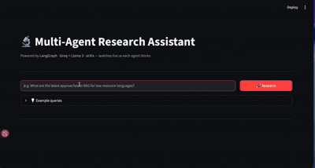

# 🔬 Multi-Agent Research Assistant

A production-quality agentic AI system that takes a research question and produces a **cited academic summary** by orchestrating four LLM agents in a LangGraph pipeline.

Built as a portfolio project demonstrating LangGraph, agentic workflows, and RAG — targeting AI/LLM Engineer roles.

> **Live demo:** *(add HuggingFace Spaces link after deployment)*

---

## Demo

<p align="center">
  
</p>

---

## Architecture

```
User (Streamlit UI)
        │
        ▼
FastAPI /research/stream  ──────────────────────────────────────────
        │
        ▼
┌─────────────────────── LangGraph StateGraph ─────────────────────┐
│                                                                   │
│   [Orchestrator Node]                                             │
│       Breaks the question into 1–3 arXiv search queries          │
│           ↓                                                       │
│   [Search Agent Node]                                             │
│       Queries arXiv API, returns top 5 papers per sub-query      │
│           ↓                                                       │
│   [Analysis Agent Node]                                           │
│       Extracts key findings, groups themes, flags contradictions  │
│           ↓                                                       │
│   [Writer Agent Node]                                             │
│       Writes a structured markdown report with inline citations   │
│                                                                   │
└───────────────────────────────────────────────────────────────────┘
        │
        ▼ SSE stream (agent_trace events → final report)
        │
Streamlit UI renders live agent steps → final report + sources
```

### State that flows through the graph

| Field | Type | Description |
|---|---|---|
| `query` | str | Original user question |
| `sub_queries` | list[str] | arXiv search queries from Orchestrator |
| `search_results` | list[dict] | Raw paper data from arXiv |
| `analysis` | dict | Themes, findings, contradictions |
| `final_report` | str | Markdown report |
| `sources` | list[dict] | Citation-ready paper list |
| `agent_trace` | list[dict] | Real-time log of each agent's work |

---

## Tech Stack

| Layer | Technology |
|---|---|
| Agent orchestration | **LangGraph** (StateGraph) |
| LLM | **Claude Sonnet** via `langchain-anthropic` |
| Academic search | **arXiv API** (`arxiv` Python package) |
| Backend | **FastAPI** + SSE streaming |
| Frontend | **Streamlit** |
| Deployment | **Hugging Face Spaces** (Streamlit SDK) |

---

## Setup

### Prerequisites
- Python 3.11+
- Anthropic API key ([get one here](https://console.anthropic.com))

### Local development

```bash
# 1. Clone and enter the project
git clone https://github.com/Akramtaha98/multi-agent-research-assistant
cd multi-agent-research-assistant

# 2. Create virtual environment
python -m venv .venv
source .venv/bin/activate  # Windows: .venv\Scripts\activate

# 3. Install dependencies
pip install -r requirements.txt

# 4. Add your API key
cp .env.example .env
# Edit .env and add: ANTHROPIC_API_KEY=sk-ant-...

# 5. (Optional) Smoke-test the pipeline before starting servers
python test_pipeline.py

# 6. Start both servers
# Terminal 1:
make api     # FastAPI on http://localhost:8000

# Terminal 2:
make ui      # Streamlit on http://localhost:8501
```

---

## Example Output

**Query:** *"What are the latest approaches to RAG for low-resource languages?"*

**Agent trace (live in UI):**
```
🧭 Orchestrator  → Decomposed into 3 sub-queries: RAG low-resource languages, 
                    multilingual retrieval augmented generation, cross-lingual QA
🔍 Search Agent  → Retrieved 14 unique papers from arXiv
🧠 Analysis Agent → Identified 3 themes: multilingual embeddings, cross-lingual 
                    transfer, retrieval quality. Found 1 contradiction.
✍️  Writer Agent  → Compiled 520-word report with 14 cited sources
```

*(Add a screenshot here after first run)*

---

## Deployment — Hugging Face Spaces

1. Create a new Space on [huggingface.co/spaces](https://huggingface.co/spaces) with **Streamlit** SDK
2. Push this repo to the Space's git remote
3. In the Space **Settings → Secrets**, add `ANTHROPIC_API_KEY`
4. HF Spaces runs `app.py` — which starts FastAPI on port 8000 and Streamlit on port 7860

---

## Author

**Akram Taha Zeyad** — PhD Candidate, NLP/LLM  
Universiti Kebangsaan Malaysia (UKM)  
Researching multilingual RAG for Arabic and Malay.

[GitHub](https://github.com/Akramtaha98) · [Related project: Multilingual RAG Chatbot](https://github.com/Akramtaha98/multilingual-rag-chatbot)
